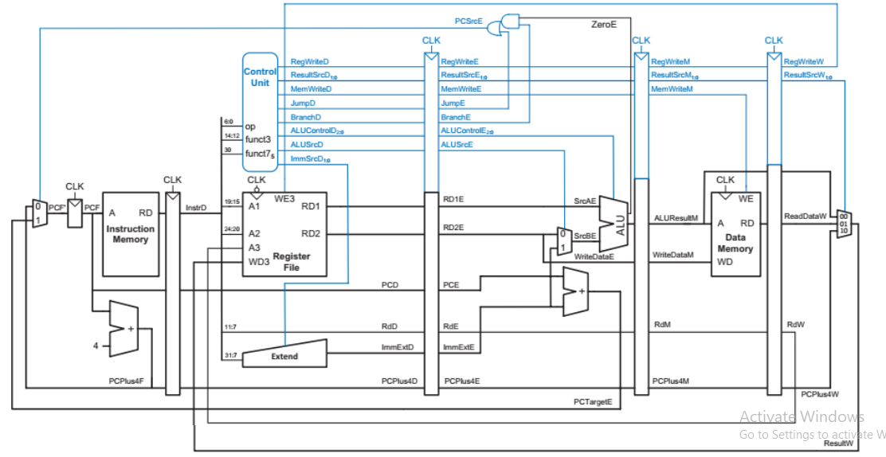
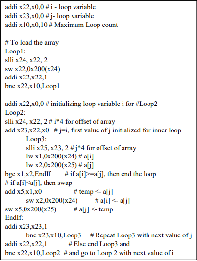
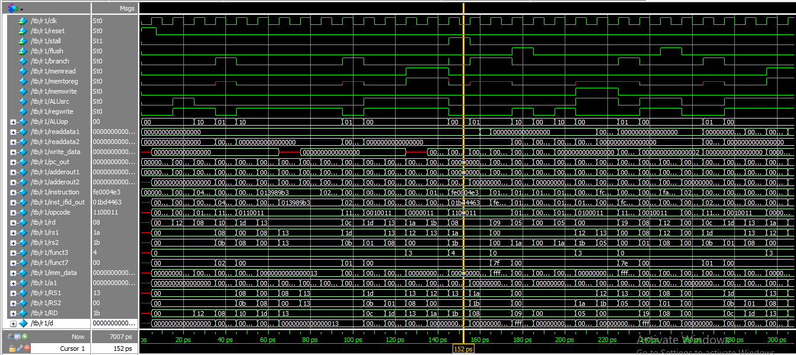
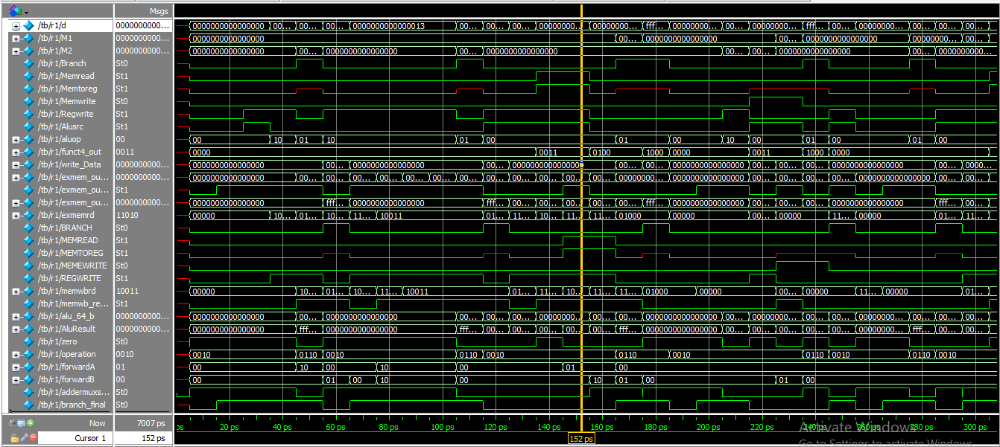

---

# **5-Stage Pipelined RISC-V Processor (Verilog Implementation)**

This project implements a fully pipelined **5-stage RISC-V processor (RV64I)** capable of executing arithmetic, memory, branching, and loop-based programs.
To validate the design, a **sorting algorithm implemented in RISC-V assembly** was executed through the pipeline.

---

# 📌 **Processor Architecture**

---

# 🚀 **Features**

* Fully pipelined **IF–ID–EX–MEM–WB** architecture
* Forwarding unit for resolving RAW hazards
* Hazard detection unit for load-use stalls
* Branch handling with pipeline flushing
* Register File (32 × 64-bit registers)
* Immediate generator (I, S, B, U, J formats)
* ALU + ALU Control for all supported RV64I ops
* Instruction & Data Memory
* Modular design suited for FPGA or simulation (ModelSim, Vivado)

---

# 🧩 **Pipeline Stages**

| Stage   | Description                                                     |
| ------- | --------------------------------------------------------------- |
| **IF**  | Fetches instruction from Instruction Memory                     |
| **ID**  | Decodes instruction, reads registers, generates control signals |
| **EX**  | ALU operations, branch decision, forwarding                     |
| **MEM** | Data memory access for load/store                               |
| **WB**  | Writes results back to Register File                            |

---

# 📦 **Modules Overview**

### ✔ Program Counter

Handles next PC update, supports stall & reset.

### ✔ Instruction Memory

Stores preloaded RISC-V instructions used for simulation.

### ✔ Register File

Dual-read, single-write 64-bit register array.

### ✔ Control Unit

Generates:
`aluSrc`, `memRead`, `memWrite`, `branch`, `memToReg`, `regWrite`.

### ✔ ALU + ALU Control

Supports:
ADD, SUB, AND, OR, XOR, SLT, SLL, SRL, etc.

### ✔ Data Memory

64-byte RAM for load/store testing.

### ✔ Pipeline Registers

IF/ID, ID/EX, EX/MEM, MEM/WB for data propagation.

### ✔ Forwarding Unit

Resolves EX–MEM and MEM–WB hazards.

### ✔ Hazard Detection Unit

Detects load-use hazards and issues pipeline stalls.

---

# 🔢 **Assembly Program Used for Testing (Sorting 10 Elements)**

To validate hazards, forwarding, nested loops, memory access, and branching,
the processor executes the following **sorting algorithm** written in RISC-V assembly.

### **Assembly Instructions → Hex Encoding**

| Assembly Instruction | Hex Code       |
| -------------------- | -------------- |
| `addi x22,x0,0`      | `32'h00000913` |
| `addi x23,x0,0`      | `32'h00000433` |
| `addi x10,x0,10`     | `32'h04b40863` |
| `slli x24, x22, 2`   | `32'h00800eb3` |
| `sw x22,0x200(x24)`  | `32'h000409b3` |
| `addi x22,x22,1`     | `32'h013989b3` |
| `bne x22,x10,Loop1`  | `32'h013989b3` |
| `addi x22,x0,0`      | `32'h02be8663` |
| `slli x24, x22, 2`   | `32'h001e8e93` |
| `add x23,x22,x0`     | `32'h00898993` |
| `slli x25, x23, 2`   | `32'h00093d03` |
| `lw x1,0x200(x24)`   | `32'h0009bd83` |
| `lw x2,0x200(x25)`   | `32'h01bd4463` |
| `bge x1,x2,EndIf`    | `32'hfe0004e3` |
| `add x5,x1,x0`       | `32'h01a002b3` |
| `sw x2,0x200(x24)`   | `32'h01b93023` |
| `sw x5,0x200(x25)`   | `32'h0059b023` |
| `addi x23,x23,1`     | `32'hfc000ce3` |
| `bne x23,x10,Loop3`  | `32'h00140413` |
| `addi x22,x22,1`     | `32'h00890913` |
| `bne x22,x10,Loop2`  | `32'hfa000ae3` |

### **What the Program Does**

* Initializes an array of 10 elements
* Nested loops using `x22` and `x23`
* Loads two array values using computed offsets
* Compares them using `bge`
* Swaps if needed
* Continues until the array is fully sorted

This program stresses:

* **Forwarding paths**
* **Load-use hazards**
* **Branch decisions**
* **Memory access patterns**
* **Pipeline stall logic**

---

# 🧪 Simulation Output

Add your testbench images:

---

# ⚠️ Challenges Faced

### **1. Hazard Handling**

Solved using forwarding + stall logic.

### **2. Memory Alignment**

Resolved using left shifts (`slli`) for word-aligned addresses.

---

# 📝 Limitations

* No branch prediction
* Forwarding limited to ALU results
* No multiplication/division (`M` extension)
* Small memory size

---

# 📈 Future Enhancements

* Add branch predictor
* Add caches / memory hierarchy
* Support MUL/DIV instructions
* Floating-point pipeline (RV64F/RV64D)
* Superscalar version
---

# 📚 Conclusion

The project successfully demonstrates a modular **5-stage pipelined RISC-V processor** that can execute real assembly programs with correct hazard handling and pipeline behavior.
The sorting program verifies the processor under nested branching, memory operations, and data hazards, proving the robustness of the design.

Reference: Harris, D., & Harris, S. (2010). Digital design and computer architecture. Morgan Kaufmann

---

